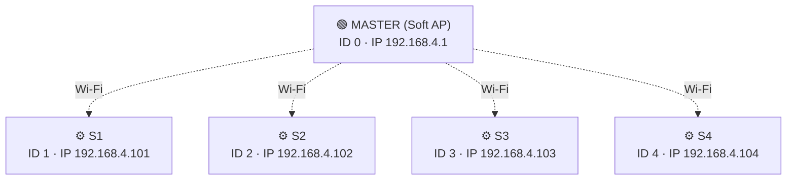
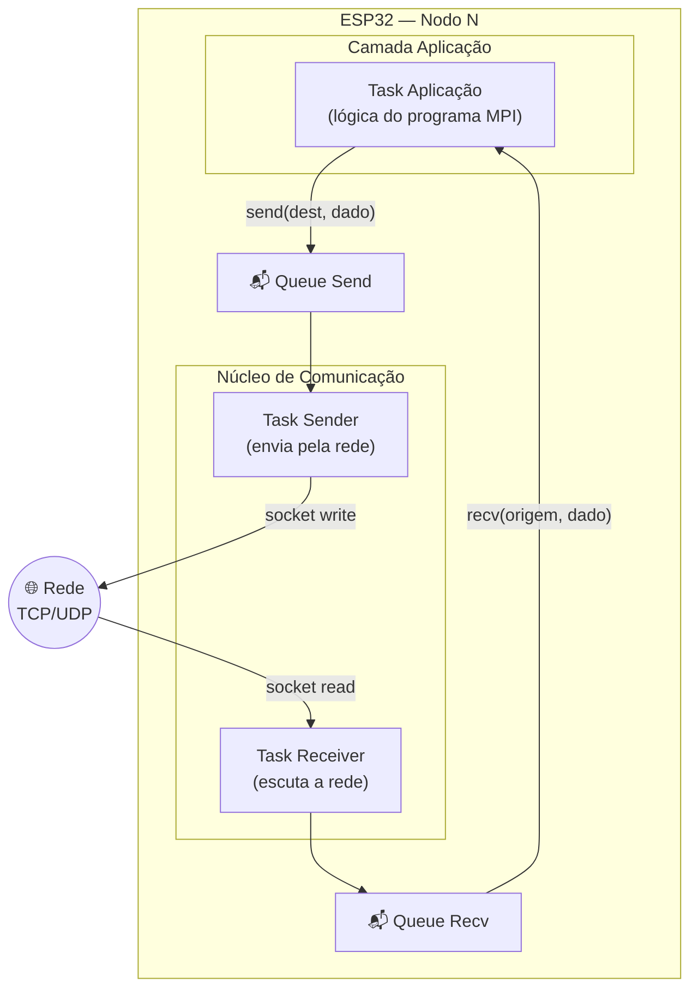
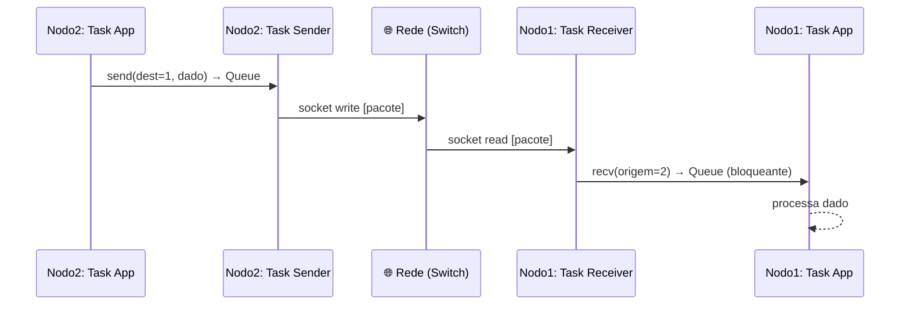
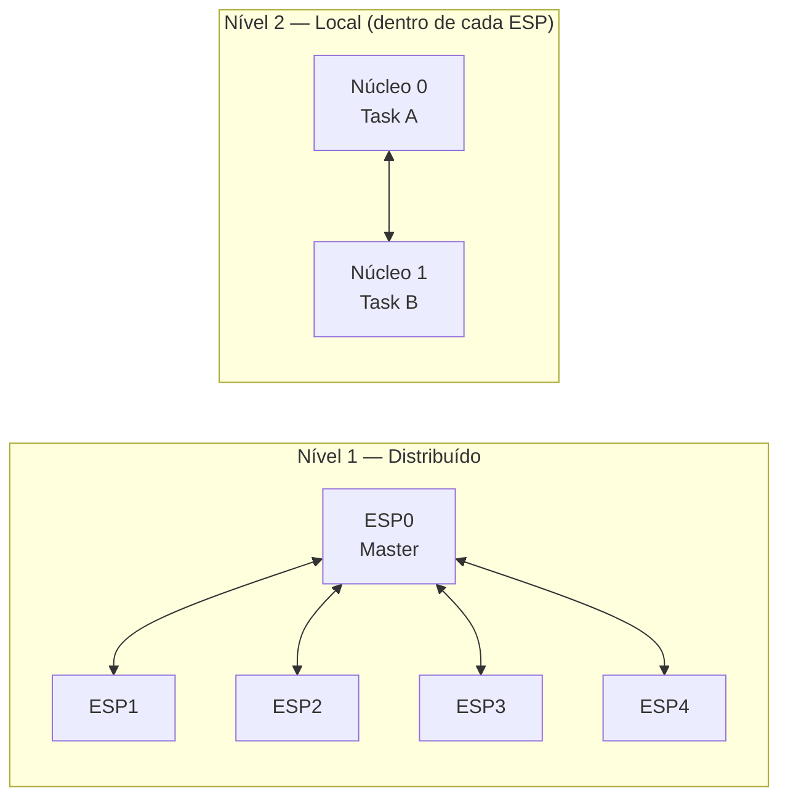

### 1. Topologia Física — Estrela Wi-Fi (Master-Worker)

> 1 Master (Access Point) + 4 Workers, todos conectados via Wi-Fi. O Master sobe um Soft AP e os Workers conectam nele.



**Resumo:**
- O **Master** roda como **Soft AP** (cria a rede Wi-Fi). Os Workers conectam nessa rede como stations.
- Comunicação é **ponto-a-ponto via sockets TCP/UDP** — os Workers se comunicam direto entre si (não precisa passar pelo Master como relay).
- **Evolução futura:** migrar pra módulos Ethernet + switch + cabos quando o hardware chegar.

---

### 2. Arquitetura Interna de um Nodo (ESP32)

> Cada ESP32 roda 3 tipos de Task FreeRTOS, usando os 2 núcleos (dual-core).



**Conceito-chave:**
- **Task Aplicação** = o código do usuário (o "programa MPI").
- **Task Sender** = pega mensagens da Queue e transmite via socket (não-bloqueante).
- **Task Receiver** = escuta a rede e deposita mensagens na Queue (bloqueante pro consumidor).
- Comunicação entre tasks usa **FreeRTOS Queues** (thread-safe, sem polling).

---

### 3. Formato do Pacote (Mensagem na Rede)

> Estrutura flat que cada nodo envia/recebe via socket.

| Campo | Descrição |
|---|---|
| `TASK_ORIG` | ID da task remetente |
| `NODO_ORIG` | ID do nodo remetente |
| `TASK_DEST` | ID da task destinatária |
| `NODO_DEST` | ID do nodo destinatário |
| `TAM_MSG` | Tamanho da mensagem (bytes) |
| `TIPO` | Tipo da mensagem (dado, controle, broadcast…) |
| `MENSAGEM` | Payload (os dados de fato) |

```
┌───────────┬───────────┬───────────┬───────────┬─────────┬──────┬───────────┐
│ TASK_ORIG │ NODO_ORIG │ TASK_DEST │ NODO_DEST │ TAM_MSG │ TIPO │ MENSAGEM  │
└───────────┴───────────┴───────────┴───────────┴─────────┴──────┴───────────┘
```

**Obs:** Memória da ESP32 é limitada (~320KB RAM). Uma imagem de 200×300 pixels ≈ 60.000 bytes — cabe, mas é quase o teto. Pensar em chunks se o payload crescer.

---

### 4. Tabela de Roteamento Estática

> Gravada em flash em todas as ESPs. No boot, cada ESP lê seu próprio MAC e se identifica na tabela.

| Papel | ID (Rank) | MAC | IP |
|---|---|---|---|
| **Master (AP)** | 0 | 123 | 192.168.4.1 |
| **S1** | 1 | 321 | 192.168.4.101 |
| **S2** | 2 | 333 | 192.168.4.102 |
| **S3** | 3 | 222 | 192.168.4.103 |
| **S4** | 4 | 111 | 192.168.4.104 |

**Fluxo do `init()`:**
1. Lê MAC Address da própria ESP.
2. Busca na tabela estática → descobre seu ID/Rank.
3. Se for Master → sobe Soft AP. Se for Worker → conecta no Wi-Fi do Master.
4. Abre sockets de escuta (Receiver) e prepara Sender.
5. Cria as Tasks FreeRTOS (Aplicação, Sender, Receiver).

---

### 5. Fluxo de Comunicação entre 2 Nodos

> Exemplo: Nodo 2 envia dado para Nodo 1.



**Regras:**
- `send()` é **não-bloqueante** — coloca na Queue e volta.
- `recv()` é **bloqueante** — a Task fica parada até chegar mensagem do remetente esperado.
- A comunicação é **direta** entre nodos (não precisa passar pelo Master).

---

### 6. As 5 Primitivas — Resumo Rápido

| Primitiva | O que faz | Bloqueante? |
|---|---|---|
| `init()` | Lê MAC, descobre rank, cria tasks | — |
| `myrank()` | Retorna o ID/rank do processo | — |
| `send(dest, &dado, tam)` | Envia msg pro destino via socket | ❌ Não |
| `recv(orig, &dado, tam)` | Espera e recebe msg do remetente | ✅ Sim |
| `broadcast()` | Envia pra todos / Recebe de um | ❌/✅ |

---

### 7. Dois Níveis de Paralelismo



- **Nível 1:** Paralelismo entre ESPs (rede).
- **Nível 2:** Paralelismo entre os 2 cores da mesma ESP (FreeRTOS `xTaskCreatePinnedToCore`).

---

### 8. Fases do Projeto

| Fase | O quê | Quando | Status |
|---|---|---|---|
| **1 — Setup Wi-Fi** | Master como Soft AP, Workers conectam, testar send/recv simples | Set | 🔄 Atual |
| **2 — Primitivas** | Cada membro implementa sua primitiva isolada (tudo via Wi-Fi) | Set | ⏳ |
| **3 — Integração Wi-Fi** | Juntar primitivas, testar cluster com 5 ESPs via Wi-Fi | Set/Out | ⏳ |
| **4 — Programa demo** | Rodar programa paralelo real (ex: processar imagem distribuída) | Out | ⏳ |
| **5 — Ethernet (evolução)** | Migrar pra módulos Ethernet + switch + cabos | Out (se der) | ⏳ |
| **6 — Entrega** | Documentação final + demonstração funcional | Deadline Out | ⏳ |

---

### 9. Divisão por Membro (Referência Rápida)

| Membro | Frente | Entrega |
|---|---|---|
| 1 | `init()` | Leitura MAC + tabela + atribuição de rank |
| 2 | `send()` | Socket não-bloqueante + tabela de roteamento |
| 3 | `recv()` | Lógica bloqueante + sincronização |
| 4 | `broadcast()` | Send 1:N + Receive N:1 |
| 5 | `myrank()` | Mapeamento Task → Rank/ID |
| 6 | Infra & Tabela | FreeRTOS tasks, alocação de núcleos, hardware |
| 7 | Flash & Testes | Automação de gravação, testes de integração |


